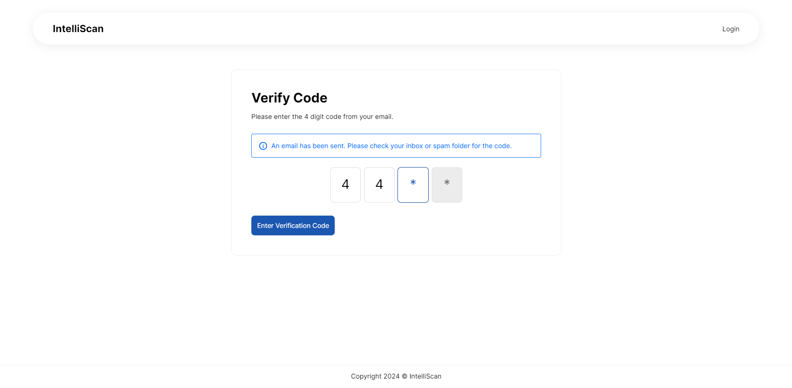
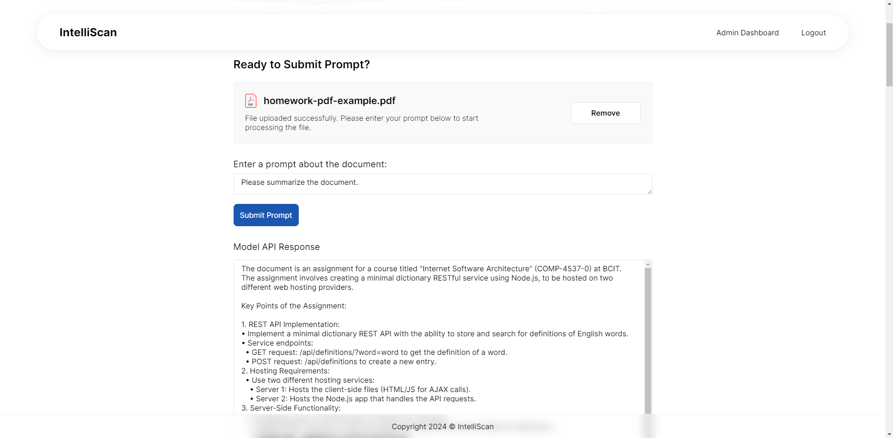
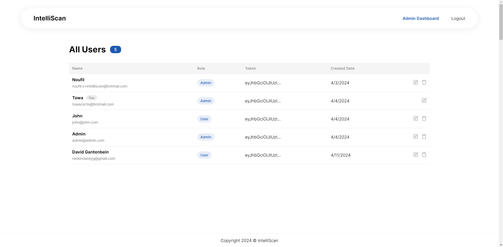
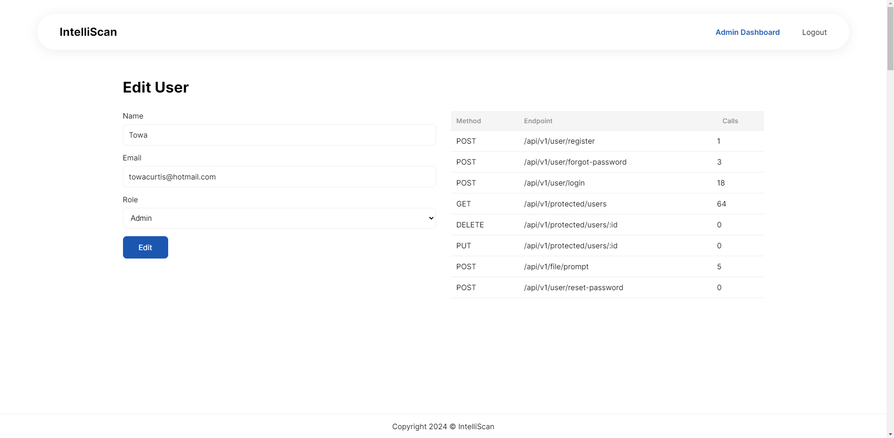

# IntelliScan


An AI-powered web application that enables users to upload PDF files, ask questions based on the document, and receive answers. Utilizing our proprietary AI-predictive model, the application scans the PDF document and provides answers based on user prompts. Additionally, IntelliScan offers an admin dashboard for administrators to manage users and monitor API usage.

> [!IMPORTANT]
> Due to ongoing maintenance, the API endpoint that processes requests sent to the AI model microservice is currently down to prevent misuse. Users can still upload files and submit prompts, but responses will not be returned until the service is restored.

_Check out the live project [_here_](https://intelliscan.towaquimbayo.com/)._

## Table of Contents

* [Screenshots](#screenshots)
* [Acknowledgements](#acknowledgements)
* [Technologies](#technologies)
* [Usage](#usage)
  * [Prerequisites](#prerequisites)
  * [Installation](#installation)
  * [Environment Variables Setup](#environment-variables-setup)
  * [Run The App](#run-the-app)
* [Features](#features)
  * [User Management](#user-management)
  * [PDF File Upload](#pdf-file-upload)
  * [AI Document Processing](#ai-document-processing)
  * [Admin Dashboard](#admin-dashboard)

## Screenshots

|  |  |
|:--:|:--:|
| _Login Page_ | _Forgot Password Page_ |
|  |  |
| _Home Page_ | _Prompt and AI-Model Response_ |
|  |  |
| _Admin Dashboard Page_ | _User API Usage Page_ |

## Acknowledgements

* Towa Quimbayo [GitHub](https://github.com/towaquimbayo) [LinkedIn](https://www.linkedin.com/in/towa-quimbayo/)
* Noufil Saqib [GitHub](https://github.com/noufilsaqib) [LinkedIn](https://www.linkedin.com/in/muhammad-noufil-saqib/)
* Maximillian Yong [GitHub](https://github.com/MaximillianYong) [LinkedIn](https://www.linkedin.com/in/maximillianyong)
* Juan Escalada [GitHub](https://github.com/jescalada) [LinkedIn](https://www.linkedin.com/in/jescalada/)

[](https://github.com/towaquimbayo/IntelliScan/graphs/contributors)

## Technologies

* React.js `v18.2.0`
* CSS3
* React Helmet `v6.1.0`
* React Redux `v8.1.1`
* React Verification-Input `v4.1.1`
* Redux `v4.2.1`
* Redux-Thunk `v2.4.2`
* Node.js
* Express `v4.18.2`
* JWT Authentication `v9.0.0`
* MongoDB / Mongoose `v6.3.3`
* Multer `v1.4.5`
* Nodemailer `v6.9.13`
* Nodemon `v3.1.0`
* TypeScript `v4.9.4`
* Zod `v3.20.2`
* Python
* FastAPI
* Google Gemma `Gemma2B-IT`
* Pydantic
* PyPDF2
* Torch
* Transformers
* Uvicorn

## Usage

<details>
  <summary>Prerequisites</summary>

### Prerequisites

* [VSCode](https://code.visualstudio.com/download/)
* [Git](https://git-scm.com/downloads/)
* [Node.js](https://nodejs.org/en/download/)

</details>

<details>
  <summary>Installation</summary>

### Installation

1. Install the latest npm package version.

  ```sh
  npm install npm@latest -g
  ```

2. Clone the repository to your local machine.

  ```sh
  git clone https://github.com/towaquimbayo/IntelliScan.git
  ```

3. Installing required dependencies requires Node and npm.

  Change the directory to Frontend and install dependencies:

  ```sh
  cd frontend
  npm install
  ```

  Change the directory to Backend and install dependencies:

  ```sh
  cd backend
  npm install
  ```

4. _(optional: self-deploying AI model)_ Clone the HuggingFace Google Gemma model to local machine.

  To run `test.py`, download the required models.

  __Note__: Ensure you have `git-lfs` installed.
  __Note__: Ensure you have at least 30 GB of free space to download. After downloading, you can delete the `.git` folder to save storage space.

  ```sh
  git clone https://huggingface.co/google/gemma-2b-it
  ```

</details>

<details>
  <summary>Environment Variables Setup</summary>

### Environment Variables Setup

For the project to run correctly, environment variables are required __only__ for the backend directory. Rename the `.env.example` to `.env`.

1. `JWT_SECRET` is the encryption key to sign your JWTs (JSON Web Tokens). Create a secret at <https://www.allkeysgenerator.com>.
2. `JWT_LIFETIME` is the amount of time a particular JWT will be valid for (i.e. `30d` for 30 days).
3. Sign up for a MongoDB Atlas account at <https://www.mongodb.com/cloud/atlas/register>. Then create a database Cluster and connect your project to that Cluster by clicking on the `Connect`, selecting the `Connect To Your Application` option and copying the Database `URI` string as your `DATABASE_URL`. Finally, replace the `username` and `password` fields in the URI string with your database credentials.
4. Either enter your email account credentials for the Nodemailer transporter credentials or create a Gmail account to generate an App Password by following the instructions at <https://medium.com/@y.mehnati_49486/how-to-send-an-email-from-your-gmail-account-with-nodemailer-837bf09a7628>.

</details>

<details>
  <summary>Run The App</summary>

### Run The App

In order to run the application, you would need the client (frontend) and server (backend) running concurrently in different terminal sessions.

#### Client-Side Usage (Frontend) on PORT: 3000

Change the directory to the client (`frontend`) and execute `npm start` to run locally in development mode or production mode. For production, make sure to build the app to the `build` folder by executing `npm run build` as this would correctly bundle React in production mode and optimize the build for the best performance.

```sh
cd frontend
npm start
```

#### Server-Side Usage (Backend) on PORT: 8080

Change the directory to the server (`backend`) and execute `npm run dev` to run locally in development mode or execute `npm start` to run in production mode. For production, make sure to build the app to the `dist` folder by executing `npm run build` as this would correctly compile TypeScript code to ES5 JavaScript codes and optimize the build for the best performance.

```sh
cd backend
npm run dev   // running locally in development mode
npm run start // running in production mode
```

#### AI-Predictive Model Usage

To create a pre-quantized model run:

```sh
create accelerated.py
```

To run the app, change the directory to the app directory and run:

```sh
uvicorn main:app --reload

// or

gunicorn main:app -w 2 -k uvicorn.workers.UvicornWorker
```

</details>

## Features

### User Management

Secure and efficient user management functionalities to ensure smooth user operations.

* __JWT Authentication__: Our authentication system ensures secure access to the application using JSON Web Tokens (JWT) stored in HttpOnly cookies. This approach protects user integrity and ensures secure session management.
* __Login/Signup__: Users can sign up and log in with a straightforward system that requires standard information: name, email, and password. This setup, combined with JWT authentication, provides robust security and seamless session handling.
* __Forgot Password__: Users who forget their password can easily reset it through a secure process. An OTP (One-Time Password) token is sent to the user's registered email for verification, ensuring the validity of the request and enabling secure password reset functionality.

### PDF File Upload

Simple and intuitive file upload system for user convenience.

* __Document File Upload:__ Users can upload PDF files either by drag-and-drop or by selecting from their local machine. The application validates the file size and type before processing. This user-friendly upload mechanism ensures that files are correctly sent to the backend for further processing by our AI model.

### AI Document Processing

Advanced AI capabilities to process documents and interact with users based on the document content.

* __AI-Predictive Model:__ Our AI-Predictive model enables users to upload PDF documents and ask questions about the content. The AI model processes the extracted text from the PDF and provides relevant answers, facilitating an interactive experience with the document.
* __PDF to Plain Text Converter__: A dedicated microservice extracts and converts PDF document text to plain text. This text is then formatted and passed to our AI model, which processes user prompts and generates accurate responses.

### Admin Dashboard

Comprehensive dashboard for administrators to manage users and monitor system usage.

* __User Management__: Administrators have access to a detailed list of users registered on the application. They can view user information, edit details, and delete users if necessary, ensuring effective user management.
* __API Usage Tracking__: The admin dashboard includes a feature to monitor API usage, allowing administrators to track the number of requests per API endpoint. This helps in rate-limiting users who exceed a certain threshold, preventing backend and microservice overload.
