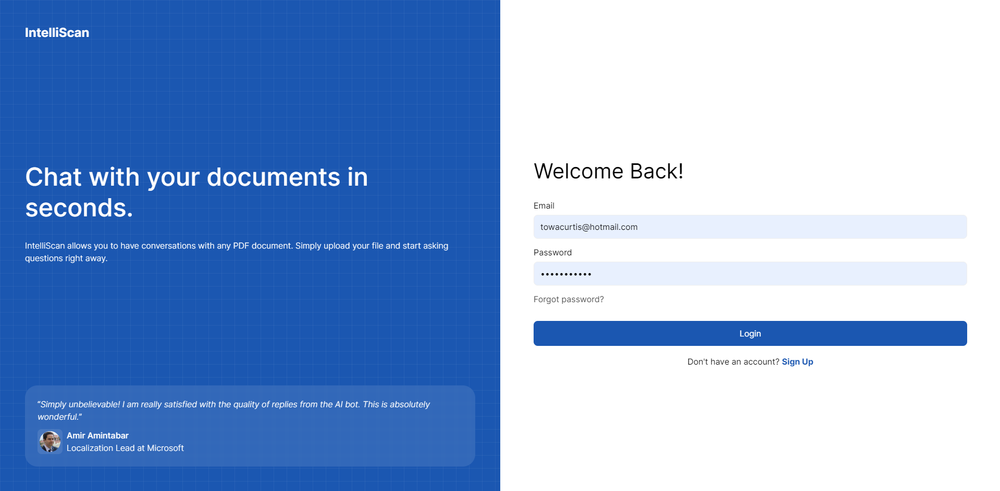
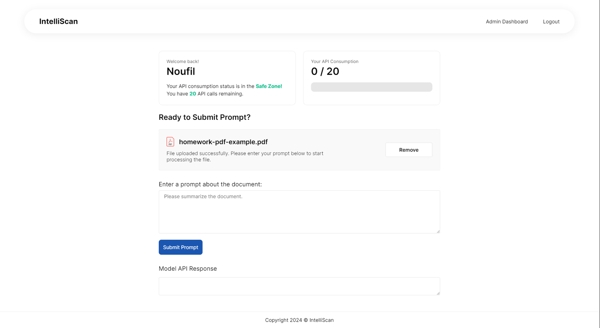
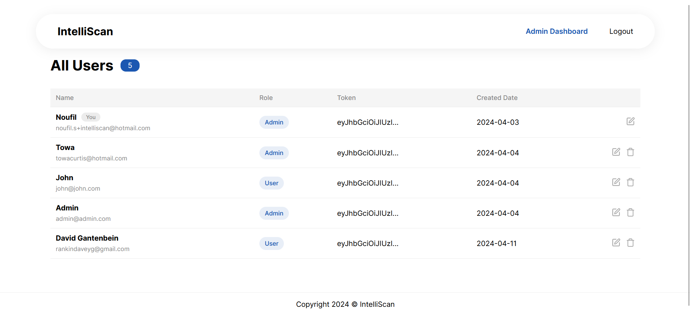

# IntelliScan - AI PDF Chat App
> An AI-powered tool that enables you to upload and ask questions about any PDF document and receive answers, along with providing an admin dashboard for API usage tracking and user management.
View the project [_here_](https://intelliscan.towaquimbayo.com/).

## Table of Contents
* [Screenshots](#screenshots)
* [Technologies](#technologies)
* [Features](#features)
* [Acknowledgements](#acknowledgements)

## Screenshots

_Login Page_

_Forgot Password Page_

_Landing Page_

_Admin Dashboard_

<!-- <figure>
    
    <figcaption>Login Page</figcaption>
</figure>

<figure>
    
    <figcaption>Forgot Password Page</figcaption>
</figure>

<figure>
    
    <figcaption>Landing Page</figcaption>
</figure>

<figure>
    
    <figcaption>Admin Dashboard</figcaption>
</figure> -->

## Technologies
- React.js `v18.2.0`
- Node.js
- CSS
- Python
- Redux `v4.2.1`
- MongoDB
- Google Gemma `Gemma2B-IT`

## Features
- User Authentication: Implement JSON Web Tokens for secure user authentication and session management.
  - Forgot Password: Functionality for users to reset their password through a secure process.
- PDF Upload: Capability for users to securely upload PDF documents for analysis.
- Ask Questions: Allows users to input natural language questions about the uploaded PDF.
- Admin Dashboard: Provides a comprehensive dashboard for admins with features including:
  - User Management: Control the addition, editing, and removal of user accounts.
  - API Usage Tracking:  Monitor and analyze API calls and usage patterns.

## Acknowledgements
* 
* 
* 
