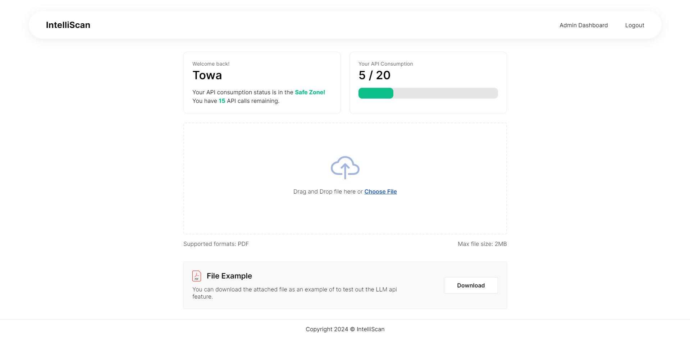

# IntelliScan - AI PDF Chat App
> An AI-powered tool that enables you to upload and ask questions about any PDF document and receive answers, along with providing an admin dashboard for API usage tracking and user management. 
> View the project [_here_](https://intelliscan.towaquimbayo.com/).

## Table of Contents
* [Screenshots](#screenshots)
* [Technologies](#technologies)
* [Features](#features)
* [Acknowledgements](#acknowledgements)

## Screenshots
|  |  |
|:--:|:--:|
| _Login Page_ | _Forgot Password Page_ |
|  |  |
| _Landing Page_ | _Admin Dashboard_ |

<!-- 
_Login Page_

_Forgot Password Page_

_Landing Page_

_Admin Dashboard_ -->

<!-- <figure>
    
    <figcaption>Login Page</figcaption>
</figure>

<figure>
    
    <figcaption>Forgot Password Page</figcaption>
</figure>

<figure>
    
    <figcaption>Landing Page</figcaption>
</figure>

<figure>
    
    <figcaption>Admin Dashboard</figcaption>
</figure> -->

## Technologies
- React.js `v18.2.0`
- Node.js
- CSS
- Python
- Redux `v4.2.1`
- MongoDB
- Google Gemma `Gemma2B-IT`

## Features
> [!CAUTION]
> Due to maintenance, the ask question API endpoint is temporarily unavailable to prevent misuse.
> 
- __User Authentication__: Implement JSON Web Tokens for secure user authentication and session management.
  - __Forgot Password__: Functionality for users to reset their password through a secure OTP process.
- __PDF Upload__: Capability for users to securely upload PDF documents for analysis.
- __Ask Questions__: Allows users to input natural language questions about the uploaded PDF.
- __Admin Dashboard__: Provides a comprehensive dashboard for admins with features including:
  - __User Management__: Control the addition, editing, and removal of user accounts.
  - __API Usage Tracking__:  Monitor and analyze API calls and usage patterns.

## Acknowledgements
* [Towa Quimbayo](https://github.com/towaquimbayo)
* [Juan Escalada](https://github.com/jescalada/)
* [Maximillian Yong](https://github.com/MaximillianYong)
